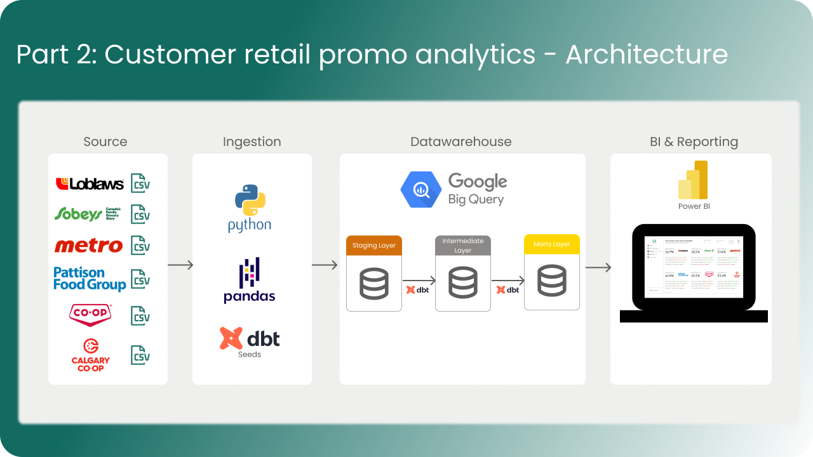
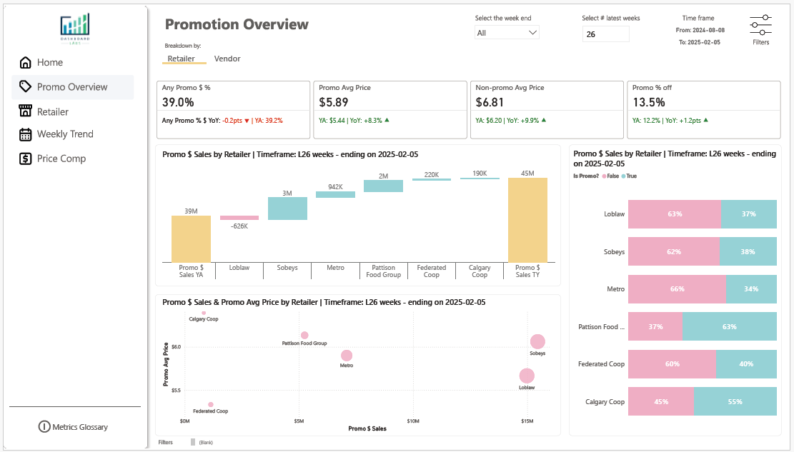

# Customer Promo Analytics

This repository contains the code and documentation for **Customer Promo Analytics**, a dbt + BigQuery + Power BI project designed to standardize promotional analysis across Canadian grocery retailers.

Promotions are one of the most important levers in retail, but retailer POS data comes in inconsistent formats and often lacks standardized promo flags. This project automates the process of:
- Standardizing retailer POS data (Loblaw, Sobeys, Metro, FCL, Calgary Co-op, Pattison Food Group).
- Flagging promo weeks consistently using Nielsen’s benchmark (14-week rolling max price, 5%+ discount drop).
- Building a unified **Promo Mart table** for cross-retailer analysis.
- Visualizing results in a **Power BI dashboard**.

📖 Full Article: [Building a Promotional Analytics Pipeline with dbt](https://www.linkedin.com/pulse/building-promotional-analytics-pipeline-dbt-bigquery-bruno-ot%25C3%25A1vio-d4jhc)

📊 Interactive Power BI Report: [Power BI Dashboard](https://app.powerbi.com/view?r=eyJrIjoiYmY3NDI1NjMtMmUwMi00ODJmLWJkZWEtMjgxN2NkNTUxZDdlIiwidCI6ImI3M2I4M2U2LWE0N2ItNGExYS1hNGIyLWY3Mjk5MGNlNjM0OSJ9)

📚 dbt Docs: [GitHub Pages Site](https://bruno-ogsilva.github.io/dbtdcocs-promo-analytics/#!/overview)

---

## Data Architecture

The project follows a layered **dbt architecture**:

- **Raw Layer**: POS extracts (as delivered by retailers).
- **Staging Layer**: Standardization (renaming, type casting, building `unique_store_id`).
- **Intermediate Layer**:
  - **Sales** – schema alignment across retailers.
  - **Stores** – enrich with discount vs conventional channel.
  - **Promo** – banner+UPC+week aggregation, 14-week rolling max, % off logic.
- **Mart Layer**: Unified sales, stores, product, and promo tables.
- **Calendar**: Custom business weeks with indices for rolling logic.



---

## Key Features

- ✅ **Incremental dbt models** for performance, with 16-week refresh buffer.
- ✅ **Window functions** to calculate 14-week rolling max price per banner+UPC.
- ✅ **Promo depth buckets** (Regular, 5–10%, 10–20%, 20%+).
- ✅ **Tests and tags** for reproducibility and documentation.
- ✅ **Power BI dashboard** surfacing sales vs promo, retailer comparisons, weekly trends, and pricing dynamics.

---

## Power BI Dashboard

The Power BI dashboard brings promo analytics to life:
1. **Promotion Overview** – total sales, promo sales %, depth buckets, YoY.
2. **Overview by Retailer** – benchmark banners against each other.
3. **Weekly Trend** – promo penetration and % off over time.
4. **Price Comparison** – regular vs promo price using dbt’s rolling max logic.
5. **Metrics Glossary** – transparent definitions of all measures.



> Layout inspired by the excellent **[Nudge BI templates](https://nudgebi.com/)** – I did my best to get close to the awesome templates they provide.

---

## Repo Structure

```plaintext
├── models/
│   ├── staging/
│   ├── intermediate/
│   │   ├── sales/
│   │   ├── stores/
│   │   └── promo/
│   ├── marts/
│   └── calendar/
├── seeds/
├── analyses/
├── assets/              # Images and diagrams
├── README.md
└── dbt_project.yml
